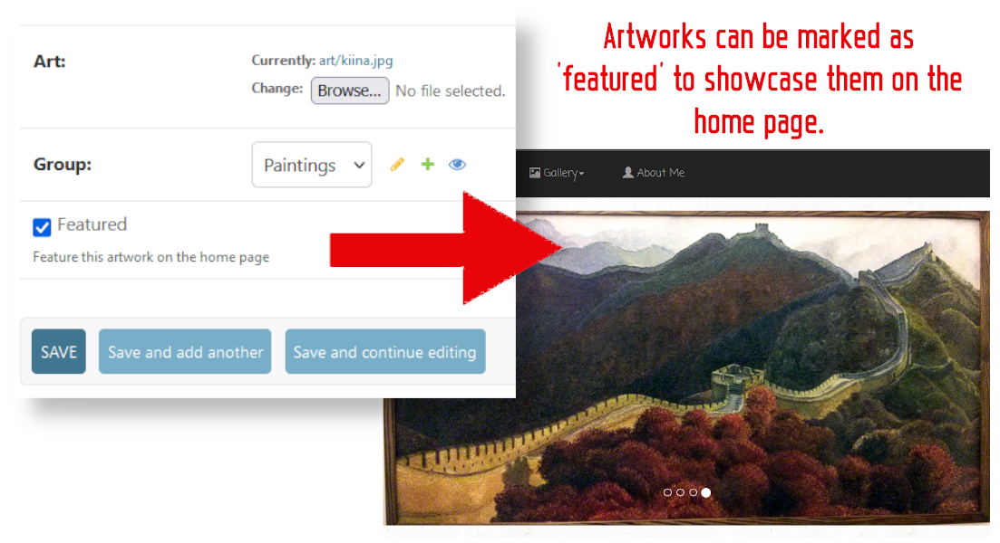
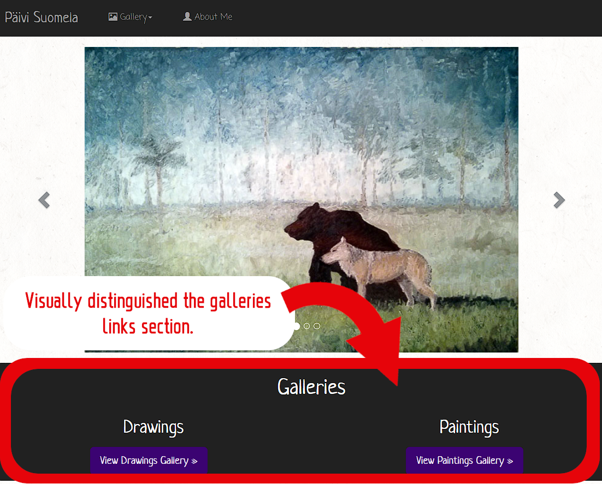
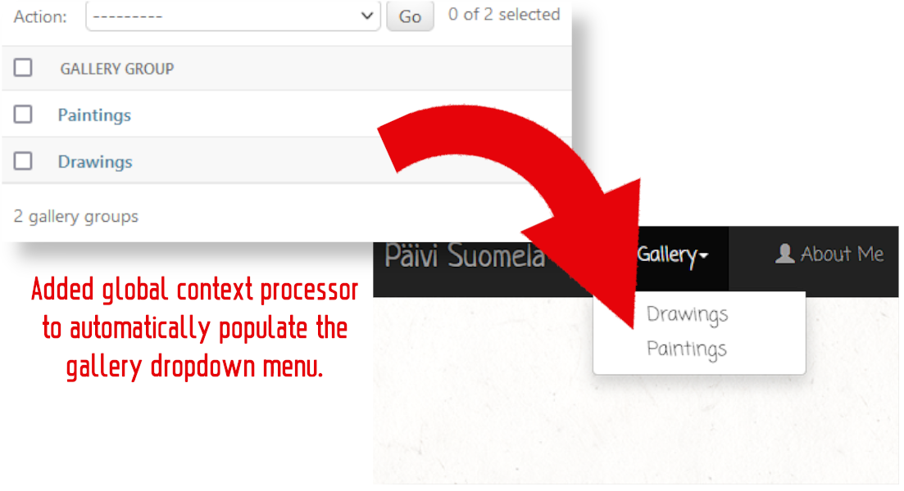
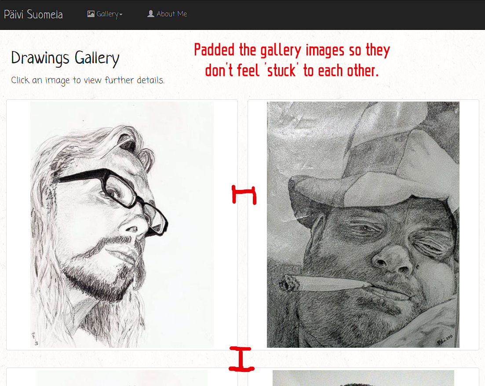
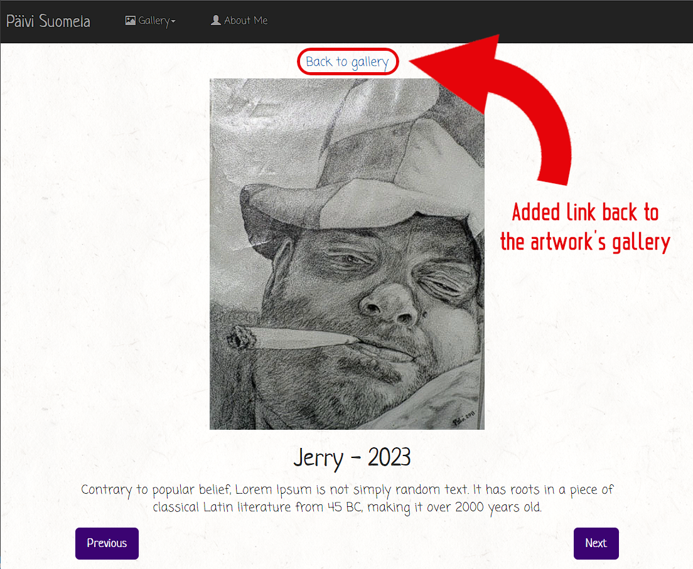

*************
My Portfolio
*************

Fork of peconia's MyPortfolio, updated for the current version of
Django as of writing (4.2.3).

Changes
#######

I sought to improve upon peconia's already commendable design with
some minor changes to the form and function:

|
|

|
|

|
|

|
|

